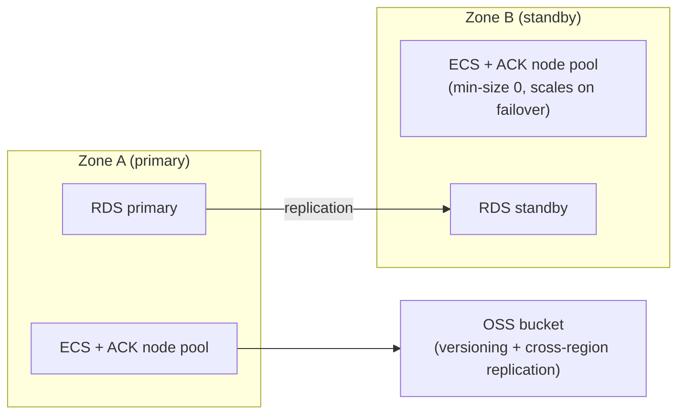

# Disaster Recovery on Alibaba Cloud: Designing for Failure

A DR plan that has never been tested is a hypothesis, not a plan. This lab runs three controlled failure experiments against a real ACK/RDS/OSS stack and measures actual recovery time against target RTOs — rather than trusting an architecture diagram.

Companion lab for the article [Disaster Recovery on Alibaba Cloud: Designing for Failure](https://raphaelgmomoh.pages.dev/articles/disaster-recovery-alibaba-cloud).

---

## Architecture Under Test



---

## Repository Structure

```text
.
├── README.md
└── src/
    ├── terraform/
    │   ├── main.tf                # ACK cluster, node pools, RDS, OSS
    │   └── standby-buffer.tf      # The fix: always-on warm standby node pool
    ├── experiments/
    │   ├── 01-container-crash.sh
    │   ├── 02-ecs-instance-failure.sh
    │   ├── 03-data-loss-oss.sh
    │   └── measure-rto.sh         # Times any experiment end-to-end
    └── results/
        └── rto-results-template.csv
```

---

## Running the Experiments

Each experiment script is self-contained and prints a start/end timestamp so you can measure real RTO, not an estimate.

### Experiment 1 — Container crash

```bash
./src/experiments/01-container-crash.sh api-pod-xyz
```

Kills PID 1 in the target pod and times how long until it's `Running` again.

### Experiment 2 — ECS/node instance failure

```bash
./src/experiments/02-ecs-instance-failure.sh i-xxxxxxxxxxxxx
```

Force-stops the ECS instance backing an ACK node and times until the autoscaler reschedules the evicted pods onto a healthy node. **This is the experiment that will most likely miss its RTO target on the first run** — see `src/terraform/standby-buffer.tf` for the fix.

### Experiment 3 — Data loss (OSS)

```bash
./src/experiments/03-data-loss-oss.sh oss://prod-data-bucket/critical-report.json
```

Deletes a versioned OSS object, then restores it from the previous version and times the recovery.

### Applying the fix after Experiment 2 fails its target

```bash
cd src/terraform
terraform apply -target=alicloud_cs_kubernetes_node_pool.standby_buffer
```

Re-run Experiment 2 — recovery should now be seconds, not minutes, because a warm buffer node absorbs evicted pods immediately instead of waiting for a fresh node to boot.

### Recording results

```bash
cp src/results/rto-results-template.csv src/results/rto-results-$(date +%F).csv
```

Fill in real numbers from your own runs — never publish an RTO you haven't actually measured.

---

## License

MIT — use it, fork it, adapt it to your own environment.
